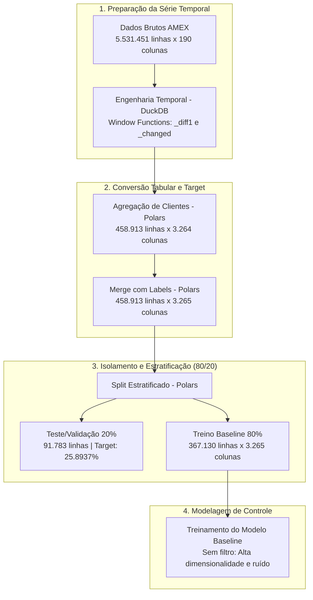

```mermaid
graph TD
    subgraph "1. Preparação da Série Temporal"
        RAW["Dados Brutos AMEX<br/>5.531.451 linhas x 190 colunas"]
        FE["Engenharia Temporal - DuckDB<br/>Window Functions: _diff1 e _changed"]
    end

    subgraph "2. Conversão Tabular e Target"
        AGG["Agregação de Clientes - Polars<br/>458.913 linhas x 3.264 colunas"]
        MERGE["Merge com Labels - Polars<br/>458.913 linhas x 3.265 colunas"]
    end

    subgraph "3. Isolamento e Estratificação (80/20)"
        SPLIT["Split Estratificado - Polars"]
        TESTE["Teste/Validação 20%<br/>91.783 linhas | Target: 25.8937%"]
        TREINO["Treino Baseline 80%<br/>367.130 linhas x 3.265 colunas"]
    end

    subgraph "4. Modelagem de Controle"
        MODEL["Treinamento do Modelo Baseline<br/>Sem filtro: Alta dimensionalidade e ruído"]
    end

    RAW --> FE
    FE --> AGG
    AGG --> MERGE
    MERGE --> SPLIT
    SPLIT --> TREINO
    SPLIT --> TESTE
    TREINO --> MODEL
```