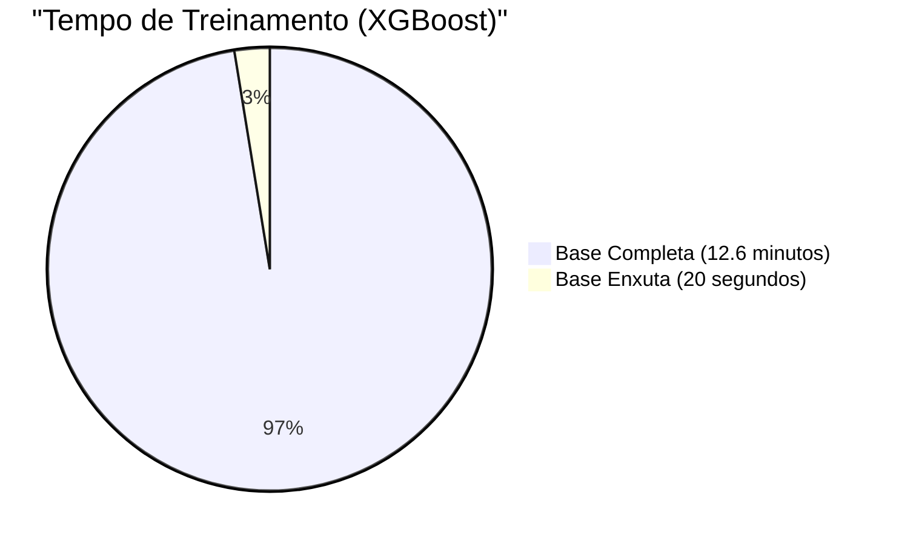
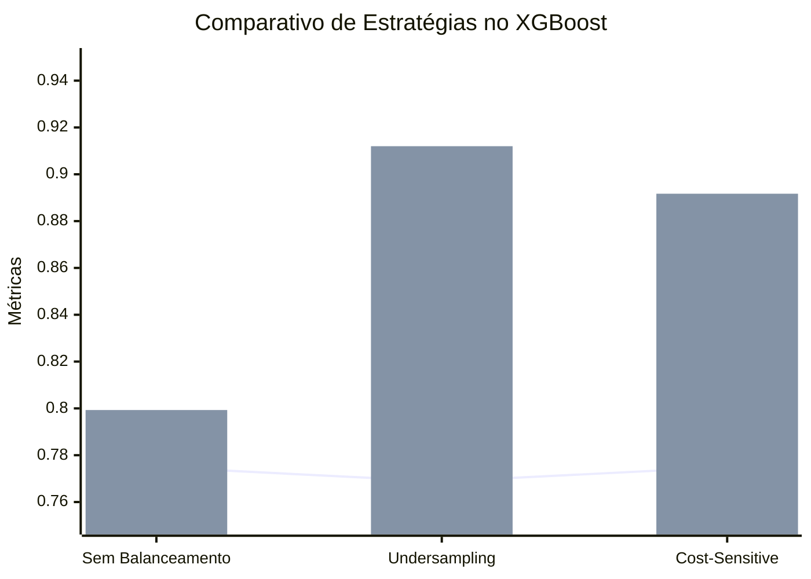

# Relatório Técnico: Prova de Conceito (Fase 1)
**Projeto:** Previsão de Inadimplência (Credit Default Prediction) - AMEX
**Ambiente de Execução:** Apple Silicon (Mac M1 PRO) - CPU (Memória Unificada)

---

## 1. Introdução e Objetivos

Este documento detalha os resultados e as justificativas teóricas da **Fase 1 (Prova de Conceito - POC)** do pipeline de *Machine Learning*. O objetivo desta fase não foi encontrar o modelo final, mas sim validar empiricamente duas hipóteses arquiteturais e metodológicas fundamentais para a construção do projeto:

1. **A Eficácia do Feature Selection:** Comprovar a hipótese da "Maldição da Dimensionalidade", comparando o desempenho dos modelos em uma base com excesso de ruído (3.265 variáveis originais) contra uma base metodologicamente filtrada (400 variáveis).
2. **A Superioridade do Tratamento Algorítmico de Classes:** Comprovar que o balanceamento via pesos (*Cost-Sensitive Learning*) supera a técnica de *Undersampling* físico ao lidar com classes minoritárias (inadimplentes).

Para garantir o rigor do método científico, utilizamos dois algoritmos contrastantes:
* **Regressão Logística (Baseline):** O padrão estatístico clássico do mercado financeiro. Sensível a ruídos e dependente de dados densos (exigiu um *Pipeline* com `SimpleImputer` para tratar valores nulos).
* **XGBoost (Estado da Arte):** Algoritmo moderno baseado em árvores de decisão, robusto contra ruídos e capaz de lidar nativamente com valores nulos.

---

## 2. Experimento 1: A Maldição da Dimensionalidade e Feature Selection

O primeiro teste consistiu em treinar os modelos em dois cenários: a base bruta completa (para testar a resistência dos algoritmos ao ruído extremo) e a base enxuta.

### 2.1. Tabela de Resultados (Dimensionalidade)

| Modelo | Base de Dados | Tempo de Treino | AMEX Score | ROC AUC | AUPRC |
| :--- | :--- | :--- | :--- | :--- | :--- |
| **Logistic Regression** | Completa (3265 features) | 4323.88 s (~72 min) | 0.1169 | 0.5879 | 0.3178 |
| **XGBoost** | Completa (3265 features) | 761.48 s (~12 min) | 0.7710 | 0.9562 | 0.8848 |
| **Logistic Regression** | Enxuta (400 features) | 85.79 s (~1.5 min) | 0.7475 | 0.9487 | 0.8642 |
| **XGBoost** | Enxuta (400 features) | **20.52 s** | **0.7749** | **0.9574** | **0.8877** |

### 2.2. Diagrama de Impacto do Feature Selection no XGBoost

### 2.3. Análise e Justificativa

1. **O Colapso do Baseline:** A Regressão Logística falhou catastroficamente na base completa. Tentando calcular pesos matemáticos para 3.265 variáveis, ela sofreu de instabilidade numérica (não convergiu após 500 iterações), demorou mais de uma hora para treinar e entregou um AMEX Score inútil de `0.1169`.
2. **A Ressurreição com Dados Limpos:** Ao receber a base enxuta de 400 *features*, a Regressão Logística teve seu tempo de treino reduzido de 72 minutos para 1 minuto e meio, e sua métrica AMEX saltou para `0.7475`. Isso prova que a filtragem de variáveis removeu ruídos tóxicos que destruíam a matemática do modelo linear.
3. **Otimização do Estado da Arte:** O XGBoost conseguiu se defender sozinho do ruído da base completa (AMEX Score de `0.7710`), ignorando as colunas irrelevantes. No entanto, o custo computacional foi alto (12 minutos). Com a base enxuta, o XGBoost atingiu o maior AMEX Score do experimento (`0.7749`) treinando em apenas **20 segundos** — uma redução de **37x no tempo de processamento**.

**Conclusão da POC 1:** O *Feature Selection* não é um capricho, é uma exigência estrutural. Ele salva modelos estatísticos de falhas críticas, aumenta ligeiramente o poder preditivo e reduz o custo computacional de forma drástica, viabilizando o uso de técnicas complexas como otimização de hiperparâmetros (Fase 3).

---

## 3. Experimento 2: Tratamento de Desbalanceamento

Em problemas de crédito, os "bons pagadores" (0) esmagam em volume os "caloteiros" (1). A métrica secundária mais crítica aqui é o **Recall** (a capacidade do modelo de não deixar um caloteiro passar despercebido). Testamos três abordagens utilizando a base enxuta.

### 3.1. Tabela de Resultados (Balanceamento)

| Estratégia | Modelo | Tempo Treino | AMEX Score | AUPRC | Recall |
| --- | --- | --- | --- | --- | --- |
| **Sem Balanceamento** | Logistic Regression | 78.17 s | 0.7447 | 0.8643 | 0.7533 |
| **Sem Balanceamento** | XGBoost | 20.48 s | 0.7749 | 0.8868 | 0.7993 |
| **Undersampling (Físico)** | Logistic Regression | 40.77 s | 0.7502 | 0.8664 | 0.8855 |
| **Undersampling (Físico)** | XGBoost | 13.00 s | 0.7688 | 0.8838 | **0.9120** |
| **Algorítmico (Cost-Sens.)** | Logistic Regression | 83.74 s | 0.7475 | 0.8642 | 0.8841 |
| **Algorítmico (Cost-Sens.)** | XGBoost | 20.31 s | **0.7749** | **0.8877** | 0.8917 |

### 3.2. Trade-off: AMEX Score vs Recall (XGBoost)

*(Legenda: Linha representa o AMEX Score Global | Barras representam o Recall)*

### 3.3. Análise e Justificativa

1. **A Deficiência Nativa (Sem Balanceamento):** Sem nenhuma intervenção, os modelos priorizam a precisão na classe majoritária. O XGBoost alcançou um bom AMEX Score, mas o Recall ficou em apenas `0.7993`, significando que ele deixou passar ~20% das fraudes/calotes.
2. **A Armadilha do Undersampling:** Ao deletar fisicamente exemplos da classe majoritária até igualar as proporções, o Recall disparou para seu máximo (`0.9120` no XGBoost). Contudo, essa deleção causou uma severa perda de informação global, resultando na **queda do AMEX Score** (de `0.7749` para `0.7688`). O modelo ficou excessivamente pessimista.
3. **O Ponto de Equilíbrio (Cost-Sensitive Learning):** Ao manter 100% dos dados na base e apenas alterar a penalização matemática de erros na classe minoritária (`scale_pos_weight` / `class_weight`), obtivemos o melhor dos dois mundos. O Recall subiu quase 10% (de 0.79 para `0.8917`), e o AMEX Score foi inteiramente preservado no seu pico (`0.7749`).

**Conclusão da POC 2:** A abordagem de Balanceamento Algorítmico (*Cost-Sensitive*) demonstrou superioridade em relação à modificação física da base de dados. Ela retém toda a variância da classe majoritária ao mesmo tempo em que força o modelo a detectar a classe minoritária.